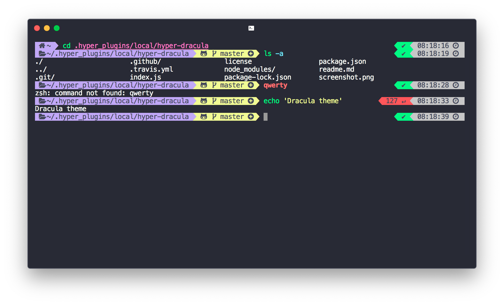

# GitHub Dark for [Hyper](https://hyper.is)

> A port of the GitHub Dark default theme for [Hyper.app](https://hyper.is).

## Install

All instructions can be found at [hyper.is/store/hyper-gh-dark-default](https://hyper.milovangudelj.com/store/hyper-gh-dark-default).

## Tips

The screenshot shown is a combination of the following additional software:

- [Fish Shell](https://github.com/fish-shell/fish-shell)
- [Oh My Posh](https://github.com/jandedobbeleer/oh-my-posh)
- [Hack Nerd Font](https://github.com/ryanoasis/nerd-fonts/tree/master/patched-fonts/Hack)

## License

[MIT License](./LICENSE)
