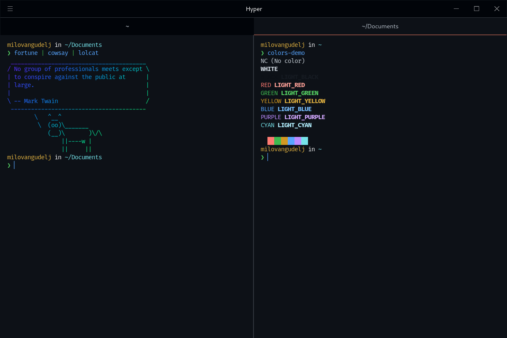

# GitHub dark default for [Hyper](https://hyper.is)

> GitHub dark default theme for [Hyper](https://hyper.is).

## Install

All instructions can be found at [hyper.milovangudelj.com/](https://hyper.milovangudelj.com/).

## Tips

The screenshot shown is a combination of the following additional software:

- [Fish Shell](https://github.com/fish-shell/fish-shell)
- [Oh My Posh](https://github.com/jandedobbeleer/oh-my-posh)
- [Hack Nerd Font](https://github.com/ryanoasis/nerd-fonts/tree/master/patched-fonts/Hack)

## License

[MIT License](./LICENSE)
